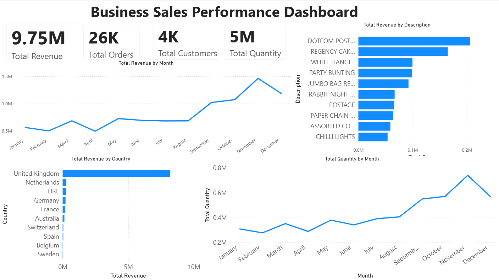

# 📊 Business Sales Performance Dashboard

## 📌 Project Overview

This project was developed as part of the **Future Interns – Data Science & Analytics Internship (Task 1)**.

The objective was to analyze business sales data and create an interactive Power BI dashboard to identify revenue trends, top-selling products, and high-performing countries. The dashboard provides business insights that can help improve decision-making.

---

## 🎯 Objectives

- Analyze monthly revenue trends
- Identify top-selling products
- Compare revenue across different countries
- Analyze monthly sales quantity
- Build an interactive business dashboard
- Generate business insights and recommendations

---

## 🛠️ Tools Used

- Microsoft Power BI
- Microsoft Excel / CSV
- GitHub

---

## 📈 Key Performance Indicators (KPIs)

- 💰 Total Revenue
- 🛒 Total Orders
- 👥 Total Customers
- 📦 Total Quantity Sold

---

## 📊 Dashboard Visuals

- Monthly Revenue Trend
- Top 10 Products by Revenue
- Revenue by Country
- Monthly Quantity Trend
- KPI Summary Cards

---

## 🔍 Key Insights

- Total revenue reached **9.75M**.
- Revenue increased significantly during the final quarter, with **November** recording the highest sales.
- A small number of products generated a major portion of total revenue.
- The **United Kingdom** contributed the highest revenue among all countries.
- Sales quantity followed a similar upward trend as revenue, indicating increased customer demand.

---

## 💡 Recommendations

- Increase inventory before peak sales months.
- Focus marketing efforts on top-performing products.
- Expand business in high-performing countries.
- Improve sales strategies for lower-performing regions.
- Monitor monthly trends for better forecasting and planning.

---

## 🖼️ Dashboard Preview

---

## 📂 Project Files

- `FUTURE_DS_01.pbix`
- `Dashboard.png`
- `README.md`

## Source: https://www.kaggle.com/datasets/ulrikthygepedersen/online-retail-dataset

> **Note:** The original dataset is not included in this repository due to GitHub file size limitations.

---

## 👨‍💻 Internship

**Future Interns – Data Science & Analytics Internship**

**Task 1: Business Sales Performance Analytics**
